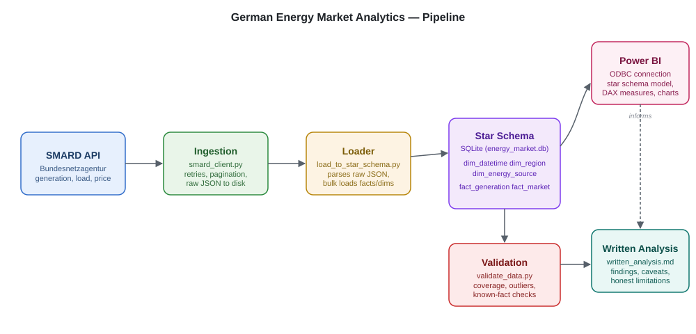

# German Energy Market Analytics

Ingests hourly generation, load, and day-ahead price data from Germany's public electricity market API, models it into a SQL star schema, validates it, and analyzes how renewable growth has affected price volatility and negative pricing. Includes a Power BI dashboard.

Built by **Muhammad Haroon Ali**

## Motive

Germany's renewable share has grown a lot over the last decade, and the electricity market is public data — SMARD publishes it hourly, no API key required. I wanted to see whether that growth actually shows up in how prices behave: more volatility, more hours where prices go negative, or not much at all. Rather than just plotting a couple of lines and calling it done, I built this as a proper pipeline — a real star schema instead of one flat table, a validation pass before anything gets analyzed, and a written report that says where the data backs up the hypothesis and where it doesn't.

## Features

- Ingestion client for the SMARD API with retries and safe re-runs — already-downloaded data is never re-fetched
- Star schema (`fact_generation`, `fact_market`, `dim_datetime`, `dim_region`, `dim_energy_source`) built with SQLAlchemy
- A validation script that checks coverage gaps, outliers, and known real-world facts (e.g. Germany's 2023 nuclear shutdown) before any dashboarding
- Power BI dashboard with DAX measures for renewable share, price volatility, and negative-price frequency
- A written analysis covering what the data supports and what it doesn't

## Tech stack

| Layer | Technology |
|---|---|
| Data source | SMARD API (Bundesnetzagentur) |
| Ingestion | Python, `requests` |
| Data model | SQLAlchemy, SQLite |
| Validation | Python, pandas |
| Dashboard | Power BI Desktop, via ODBC |
| Language | Python 3.11+ |

## Architecture



Raw data is pulled from SMARD and saved to disk untouched before any parsing happens. A separate loading step builds the star schema — two fact tables sharing three dimension tables, since generation data has an extra dimension (energy source) that price and load don't. A validation script checks the loaded data before Power BI touches it. The dashboard connects to the same SQLite file over ODBC.

## Project structure

```
energy-market-analytics/
├── src/
│   ├── smard_client.py          # API ingestion
│   ├── models.py                 # SQLAlchemy star schema
│   ├── load_to_star_schema.py    # Parses raw JSON, loads dim/fact tables
│   ├── validate_data.py          # Data validation checks
│   └── run_sql.py                # Runs a raw .sql file against the database
├── reports/
│   ├── energy_market_dashboard.pbix
│   ├── written_analysis.md
│   └── data_validation_report.md
├── docs/
│   └── architecture.svg
├── requirements.txt
└── .gitignore
```

## Prerequisites

- Python 3.11+
- Power BI Desktop (free), if you want to open the dashboard
- A SQLite ODBC driver, for the dashboard connection — no API key needed, SMARD requires no authentication

## How to run

```
git clone https://github.com/Haroonali7816/energy-market-analytics.git
cd energy-market-analytics

python -m venv venv
venv\Scripts\activate          # Windows
source venv/bin/activate       # macOS/Linux

pip install -r requirements.txt

python src/smard_client.py           # ~30-40 min, safe to interrupt/resume
python src/load_to_star_schema.py
python src/validate_data.py
```

Then open `reports/energy_market_dashboard.pbix` in Power BI Desktop. It connects via ODBC, so the data source may need re-pointing to your local file path on first open.

## Data validation

Six of seven checks passed:

| Check | Result |
|---|---|
| Row counts | Pass |
| Hourly coverage gaps | Pass |
| Nuclear shutdown consistency | Flagged — generation data runs ~9 months past Germany's confirmed shutdown date, not yet explained |
| Negative generation values | Pass |
| Price outlier scan | Pass |
| Renewable share sanity check | Pass (47% cumulative, 64% latest year) |

Full detail in `reports/data_validation_report.md`.

## Findings

Renewable share grew to roughly 64% of generation in the most recent year of data. Negative-price hours grew alongside it, consistent with renewable oversupply during low-demand periods. Price volatility is a weaker story — it spikes in 2021-2022, which lines up with the European gas crisis rather than anything about Germany's renewable mix, so that spike is more likely an external shock than a renewables effect. Full writeup in `reports/written_analysis.md`.

## Data source

[SMARD](https://www.smard.de), run by the Bundesnetzagentur (Germany's federal grid regulator). Public, free, no authentication.

## Author

**Muhammad Haroon Ali**
